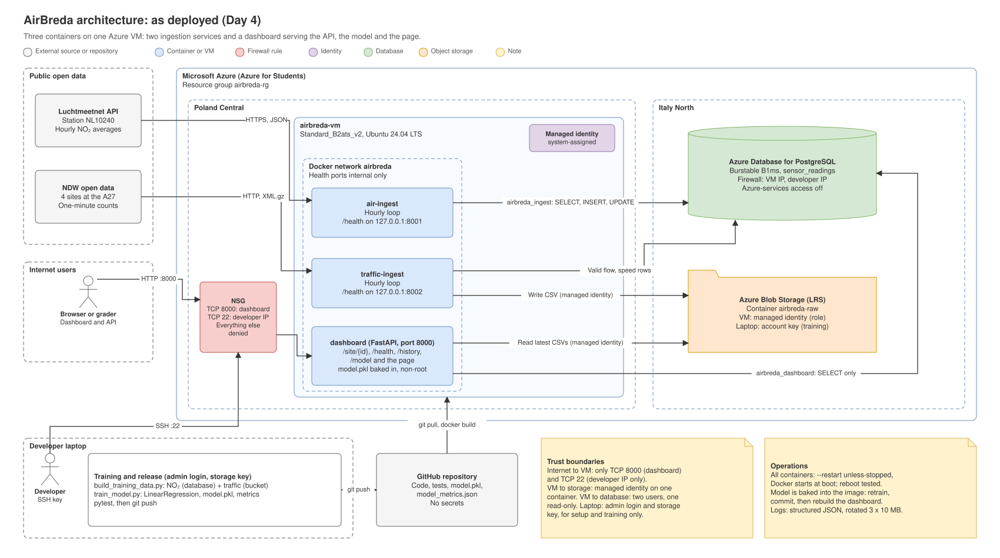

# AirBreda: Architecture Design Document

AirBreda investigates whether traffic congestion at the A27 interchange near Breda pushes air pollution nearby above safe levels. The platform ingests two Dutch open data streams, hourly NO₂ averages from Luchtmeetnet station NL10240 (RIVM) and one-minute traffic counts from four NDW measurement sites at the interchange, stores them in Azure, trains a regression model on the collected data and serves predictions through an API and a dashboard. This document records the system as deployed, the decisions behind it and what they cost.

**Live system:** [http://20.215.185.196:8000](http://20.215.185.196:8000)  
**Repository:** [github.com/RayaKichukova241329/airbreda](https://github.com/RayaKichukova241329/airbreda)

## 1. Architecture diagram

The diagram shows the system as deployed. Three containers run on one Azure VM in Poland Central: two ingestion services and a FastAPI dashboard, connected by a private Docker network. The database and the object storage run in Italy North. Every arrow that crosses a trust boundary is labelled with the identity it uses: the network security group admits only the dashboard port and SSH from the developer's IP; the VM's managed identity can access one storage container and nothing else; and the containers reach the database as two separate users, one of them read-only. The editable source is [`architecture-final.drawio`](diagrams/architecture-final.drawio). Earlier checkpoints show how the design evolved: [Day 1](diagrams/architecture-day1.svg), [Day 2](diagrams/architecture-day2.svg) and [Day 3](diagrams/architecture-day3.svg).

## 2. Architecture decision records













## 3. Trade-off justifications

**Storage.** A relational database was weighed against a document store (Azure Cosmos DB) and against SQL Server (Azure SQL Database). PostgreSQL was chosen because the core analysis joins two time series, the composite primary key enforces idempotent writes, and the free B1ms tier (list price about USD 20 per month) comfortably handles roughly 96,000 rows per year. Horizontal write scalability was given up; it would only matter around 50 million rows. Object storage was added alongside the database because NDW traffic cannot be recovered once missed, at a cost of a few cents per month.

**Compute.** A single VM was weighed against a managed container service. The VM was chosen because it runs the existing images unchanged at no cost (Standard_B2ats_v2, list price about USD 7.88 per month, covered by the free offer) and the workload is two hourly jobs and a lightly used dashboard. Automatic scaling, zero-downtime deployments and HTTPS were given up, along with any redundancy: the VM is a single point of failure.

**Messaging.** A broker between producers and consumers was weighed against direct writes. Redis was introduced on Day 2 to establish the pattern, publishing 54 messages per run alongside the direct writes, and removed on Day 3 because nothing consumed it. Decoupling for future consumers was given up in exchange for one fewer component to run; Azure Service Bus would return at 50 corridors, when Luchtmeetnet calls alone would reach 50 per five minutes.

**Disaster recovery.** Backup and Restore was weighed against Pilot Light, Warm Standby and Active-Active. It was chosen because it costs nothing extra and every component is reproducible from Git and automatic database backups, giving an estimated recovery time of one to two hours. A shorter recovery time was given up, and with it every hour of NDW traffic during an outage. Moving up a tier would first require leaving the Burstable database tier, which supports neither replicas nor high availability.

## 4. Cloud provider rationale

*Written for a policy officer at the Municipality of Breda.*

AirBreda runs on Microsoft Azure, a service that rents out computers, storage and databases in Microsoft's data centres. Instead of buying and maintaining its own server, the project uses three rented building blocks: a small computer that collects the measurements every hour and runs the website, a database that keeps all readings in order, and a storage area that keeps a copy of every traffic file.

This is appropriate for a public-sector project in the Netherlands for three reasons. First, all data stays inside the European Union: the database and storage are in Microsoft's data centre in Italy, and the computer runs in Poland, so the data remains under European privacy law. The project also stores no personal information; it only handles public air quality and traffic figures. Second, security is built in. Access is restricted at every step: only the website is open to the public, only the developer can log in to the computer, and each part of the system can reach only the data it needs. No passwords are stored in the project's code. Third, the cost is low and predictable. During this prototype phase, Azure's student programme covers the cost entirely; the normal price of the same setup is roughly 30 US dollars per month, and the platform reports exactly what is used.

Switching to another provider would be possible but not free. The project deliberately uses widely available technology, the PostgreSQL database and standard software containers, so its core would run on Amazon's or Google's cloud as well, and the municipality would not be locked in. What would be lost is the work of setting up the current environment: the access rules, the security settings and the tested deployment would have to be rebuilt and checked again, which would take days of work and carry the risk of new mistakes.

## 5. Cost estimate

Prices are Azure list prices in US dollars per month (October 2026). The current deployment is covered by the Azure for Students free offer, so its actual cost is close to zero.

| Component | Current (1 corridor) | At 10 corridors | At 50 corridors |
|---|---|---|---|
| Compute | 7.88 (VM B2ats_v2) | 7.88 (same VM) | 22.19 (Container Apps jobs 14.31, dashboard VM 7.88) |
| Database | 20.48 (B1ms, 32 GB) | 20.48 (same server) | 163.52 (General Purpose D2ds v5, 64 GB) |
| Object storage | under 0.10 | about 0.50 | 9.87 (about 1.75 million writes) |
| **Total** | **about 28.50** | **about 29** | **about 195.60** |

Source: Azure pricing calculator, October 2026 (Italy North for the database and storage, Poland Central for compute). The calculator models Container Apps by web requests, so the cost of the scheduled jobs was calculated from its published unit prices and free monthly allowances: about 8,760 runs of each job per month (every five minutes), giving 657,000 vCPU-seconds and 1,314,000 GiB-seconds, of which 180,000 and 360,000 are free. The Service Bus namespace that would accompany this design is not included.

At 10 corridors with hourly ingestion, a single VM is still the right choice: the national NDW file is downloaded once per run regardless of the number of sites, ten Luchtmeetnet calls per hour are far below the fair-use limit, and the database grows to about a million rows per year. At 50 corridors with ingestion every five minutes, a single VM is no longer appropriate: it would become a single point of failure for 50 locations, and the workload calls for scheduled container jobs, a durable queue and a General Purpose database tier, as described in ADR-004. The database becomes by far the largest cost, about 84% of the total.

## 6. Reflection

The decision I am least confident in is how traffic is sampled. Every hour, the pipeline stores a single one-minute NDW snapshot, converted to an hourly rate, and pairs it with an NO₂ value that is an average over the whole hour. The two numbers describe different things: one moment against sixty minutes. The values are always multiples of 60, and a single car more or less changes the reading by 60 vehicles per hour. To become confident, I would need to know how much a one-minute snapshot differs from the true hourly average at this interchange. That could be measured by polling every minute for a week and comparing both versions; if the difference is large, the right design is to poll more often and store hourly averages.

The final model was trained on 18 hours of data, and its result was not what I expected: the traffic coefficient turned negative, so in this data more traffic goes with slightly less NO₂, and an R² of 0.03 means the model explains almost none of the variation. That does not show that traffic has no effect. Over a day and a half, time of day and weather dominate, and earlier, a single added row moved the leave-one-out error from 47 to 6 µg/m³, which shows how fragile a model on so few hours is. With a full year of readings, almost everything about it would change. The features would include weather, above all wind speed, since the highest NO₂ in the current data occurred at almost no traffic, most likely pollution trapped on a calm night; day of the week and public holidays; the hour of day encoded as a cycle rather than a number from 0 to 23; and traffic averaged over the whole hour. The algorithm could move to gradient-boosted trees, which handle non-linear effects such as rush hours, but only if they clearly beat the linear model. The evaluation would use time-based splits, training on earlier months and testing on later ones, and compare the model against simple baselines such as "the same value as last hour". A year of data would also contain hours above 40 µg/m³, making it possible to train and calibrate a real classifier for exceedances instead of deriving the risk from a sigmoid.

If AirBreda served the municipality in production, the first thing I would add is an automated deployment pipeline combined with infrastructure as code. Today, every deployment means logging in to the VM over SSH and running commands by hand, and the Azure resources were created by clicking through the portal. A pipeline that runs the tests on every commit, builds the images and deploys them would remove the manual steps where mistakes happen, and defining the infrastructure in code (for example with Bicep or Terraform) would make the whole environment reproducible in minutes, which would also turn the Backup and Restore recovery from hours into a single command. HTTPS and alerting on the health endpoints would follow closely, because a municipal service should not depend on someone noticing that data has stopped arriving.
